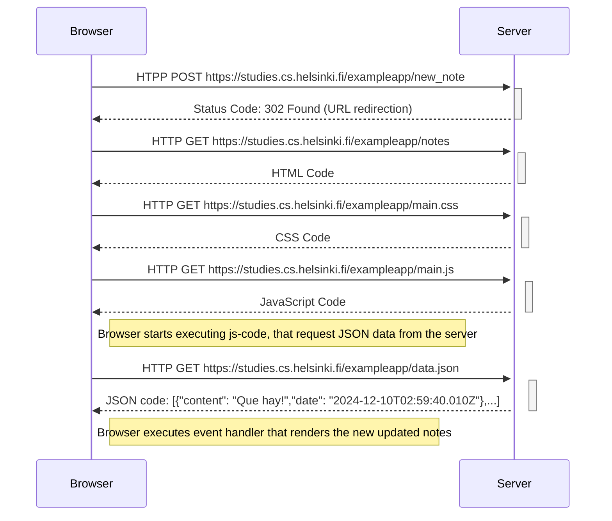

```mermaid 
    sequenceDiagram

    participant Browser
    participant Server

    Browser->>+Server: HTPP POST https://studies.cs.helsinki.fi/exampleapp/new_note
    activate Server
    Server-->>Browser: Status Code: 302 Found (URL redirection)
    deactivate Server

    Browser->>+Server: HTTP GET https://studies.cs.helsinki.fi/exampleapp/notes
    activate Server
    Server-->>Browser: HTML Code
    deactivate Server

    Browser->>+Server: HTTP GET https://studies.cs.helsinki.fi/exampleapp/main.css
    activate Server
    Server-->>Browser: CSS Code
    deactivate Server

    Browser->>+Server: HTTP GET https://studies.cs.helsinki.fi/exampleapp/main.js
    activate Server
    Server-->>Browser: JavaScript Code
    deactivate Server

    Note right of Browser: Browser starts executing js-code, that request JSON data from the server

    Browser->>+Server: HTTP GET https://studies.cs.helsinki.fi/exampleapp/data.json
    activate Server
    Server-->>Browser: JSON code: [{"content": "Que hay!","date": "2024-12-10T02:59:40.010Z"},...]
    deactivate Server
    
    Note right of Browser: Browser executes event handler that renders the new updated notes
```
