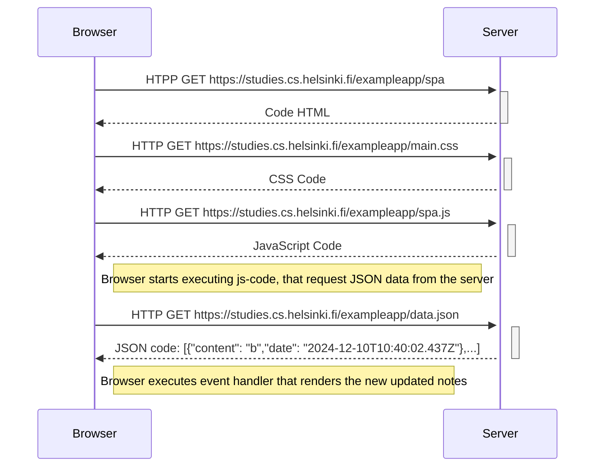

```mermaid
    sequenceDiagram
        participant Browser
        participant Server
        
        Browser->>+Server: HTPP GET https://studies.cs.helsinki.fi/exampleapp/spa
        activate Server
        Server-->>Browser: Code HTML
        deactivate Server
        
        Browser->>+Server: HTTP GET https://studies.cs.helsinki.fi/exampleapp/main.css
        activate Server
        Server-->>Browser: CSS Code
        deactivate Server
        
        Browser->>+Server: HTTP GET https://studies.cs.helsinki.fi/exampleapp/spa.js
        activate Server
        Server-->>Browser: JavaScript Code
        deactivate Server
    
        Note right of Browser: Browser starts executing js-code, that request JSON data from the server
    
        Browser->>+Server: HTTP GET https://studies.cs.helsinki.fi/exampleapp/data.json
        activate Server
        Server-->>Browser: JSON code: [{"content": "b","date": "2024-12-10T10:40:02.437Z"},...]
        deactivate Server
        Note right of Browser: Browser executes event handler that renders the new updated notes
```
