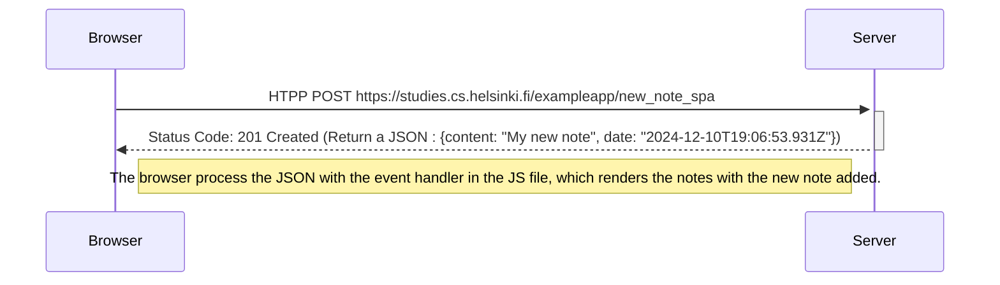

```mermaid
sequenceDiagram
    participant Browser
    participant Server

    Browser->>+Server: HTPP POST https://studies.cs.helsinki.fi/exampleapp/new_note_spa
    activate Server
    Server-->>Browser: Status Code: 201 Created (Return a JSON : {content: "My new note", date: "2024-12-10T19:06:53.931Z"})
    deactivate Server
    Note right of Browser: The browser process the JSON with the event handler in the JS file, which renders the notes with the new note added.

```
